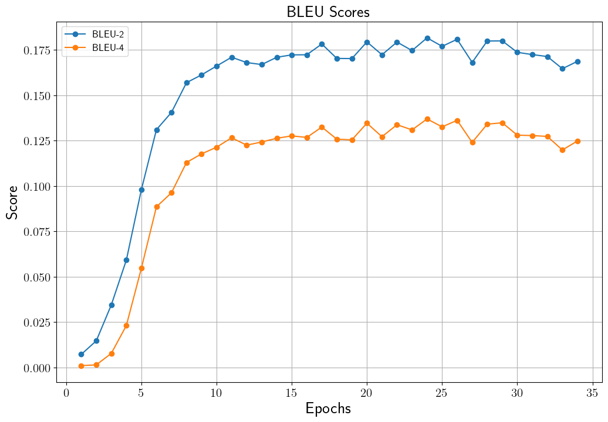

# Korean Chatbot Transformer
한국어 버전의 설명은 [여기](./docs/README_ko.md)를 참고하시기 바랍니다.

## Introduction
We will use data from the Daum Cafe ["사랑보다 아름다운 실연"]( http://cafe116.daum.net/_c21_/home?grpid=1bld) to train a chatbot model using chatbot data created by [송영숙](https://github.com/songys/Chatbot_data).
For an explanation of Transformer-based machine translation models, please refer to [Transformer를 이용한 한국어 대화 챗봇](https://ljm565.github.io/contents/transformer3.html).
Additionally, this model can utilize not only positional encoding used in vanilla transformers but also positional embedding.
Lastly, based on the final trained model, we will run an actual chatbot.
<br><br><br>

## Supported Models
### Transformer
* Transformer
<br><br><br>

## Supported Tokenizer
### Wordpiece Tokenizer
Use a subword tokenizer that performs BPE (Byte Pair Encoding) based on likelihood.

* When using `data/counselor` data, tokenizer will be trained automatically through [make_vocab.sh](src/tools/tokenizers/build/make_vocab.sh) file. You can set vocabulary size in the `config/config.yaml` (Default: 8,000).
<br><br><br>

## Base Dataset
* We will use data from the Daum Cafe ["사랑보다 아름다운 실연"]( http://cafe116.daum.net/_c21_/home?grpid=1bld) along with the chatbot data created by [송영숙](https://github.com/songys/Chatbot_data).
* If you want to use your custom data, you have to set train/validation/test data paths in the `config/config.yaml`. Also, you have to implement your custom tokenizer, data loading parts in the `src/trainer/build.py`.
<br><br><br>

## Supported Devices
* CPU, GPU, multi-GPU (DDP), MPS (for Mac and torch>=1.12.0)
<br><br><br>

## Quick Start
```bash
python3 src/run/train.py --config config/config.yaml --mode train
```
<br><br>

## Project Tree
This repository is structured as follows.
```
├── configs                           <- Folder for storing config files
│   └── *.yaml
│
└── src      
    ├── models
    |   ├── embeddings.py             <- Transformer embedding layers
    |   ├── modules.py                <- Attention, FFN, etc. layers
    |   └── transformer.py            <- Whole encoder, decoder and transformer model
    |
    ├── run                   
    |   ├── chatting.py               <- Trained model live demo execution code
    |   ├── train.py                  <- Training execution file
    |   └── validation.py             <- Trained model evaulation execution file
    |
    ├── tools                   
    |   ├── tokenizers
    |   |   ├── build                 <- Using for constructing custom tokenizer
    |   |   |   ├── make_vocab.sh
    |   |   |   └── vocab_trainer.py
    |   |   └── tokenizer.py          <- Tokenizer class
    |   |
    |   ├── early_stopper.py          <- Early stopper class file
    |   ├── evaluator.py              <- Metric evaluator class file
    |   ├── model_manager.py          
    |   └── training_logger.py        <- Training logger class file
    |
    ├── trainer                 
    |   ├── build.py                  <- Codes for initializing dataset, dataloader, etc.
    |   └── trainer.py                <- Class for training, evaluating, and calculating accuracy
    |
    └── uitls                   
        ├── __init__.py               <- File for initializing the logger, versioning, etc.
        ├── data_utils.py             <- File defining the dataset's dataloader
        ├── filesys_utils.py       
        ├── func_utils.py       
        └── training_utils.py     
```
<br><br>

## Tutorials & Documentations
Please follow the steps below to train a Transformer chatbot model.
1. [Getting Started](./docs/1_getting_started.md)
2. [Data Preparation](./docs/2_data_preparation.md)
3. [Training](./docs/3_trainig.md)
4. ETC
   * [Evaluation](./docs/4_model_evaluation.md)
   * [Live Demo](./docs/5_live_demo.md)

<br><br><br>


## Training Results
### Chatbot Training Score History
* Validation Set BLEU History<br>
<br><br>

* Validation Set NIST History<br>
<br><br>


### Result Samples
```
# Sample 1
Q : 어디로 여행 가면 좋을까?
A: 온 가족이 모두 마음에 드는 곳으로 가보세요.


# Sample 2
Q: 나 좋아하는 남자가 생겼어
A: 충분히 그럴 수 있어여.


# Sample 3
Q: 오늘 저녁 뭐 먹을까?
A: 맛있는 거 드세요.
```
<br><br><br>
