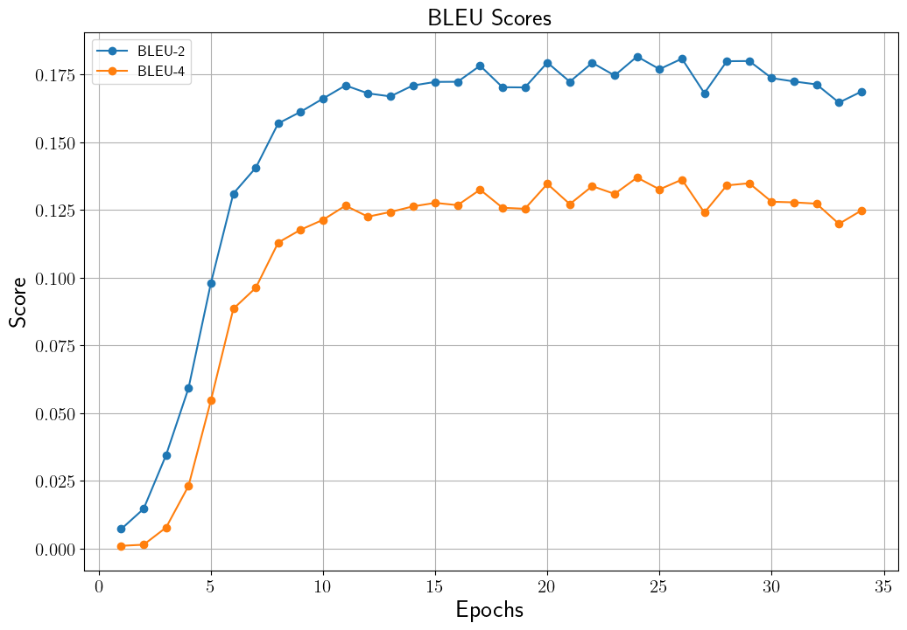
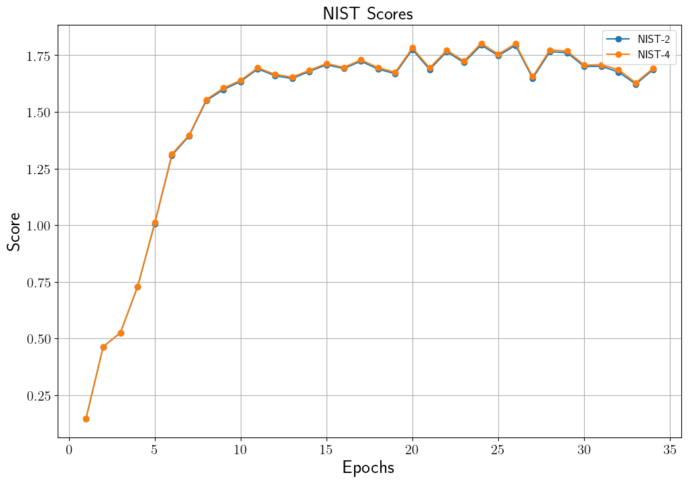

# Korean Chatbot Transformer

## Introduction
다음 카페 ["사랑보다 아름다운 실연"]( http://cafe116.daum.net/_c21_/home?grpid=1bld) 데이터를 사용하여 [송영숙](https://github.com/songys/Chatbot_data)님께서 만든 챗봇 데이터를 통해 챗봇 모델을 학습합니다.
Transformer 기반 기계 번역 모델에 대한 설명은 [Transformer를 이용한 한국어 대화 챗봇](https://ljm565.github.io/contents/transformer3.html)을 참고하시기 바랍니다.
또한 본 모델은 vanilla transformer에서 사용하는 positional encoding 뿐만 아니라, positional embedding을 선택할 수 있습니다.
마지막으로 최종 학습된 모델을 바탕으로 실제 챗봇을 구동해볼 수 있습니다.
<br><br><br>

## Supported Models
### Transformer
* Transformer
<br><br><br>

## Supported Tokenizer
### Wordpiece Tokenizer
Likelihood 기반으로 BPE를 수행한 한국어 subword 토크나이저를 사용합니다.
* `data/counselor` 데이터를 사용한다면 자동으로 [make_vocab.sh](src/tools/tokenizers/build/make_vocab.sh) 파일을 통해 토크나이저가 학습되며 로드됩니다. 토크나이저 vocabulary 크기는 `config/config.yaml`에서 설정할 수 있습니다(Default: 8,000). 
<br><br><br>

## Base Dataset
* 다음 카페 ["사랑보다 아름다운 실연"]( http://cafe116.daum.net/_c21_/home?grpid=1bld) 데이터를 사용하여 [송영숙](https://github.com/songys/Chatbot_data)님께서 만든 챗봇 데이터를 사용합니다.
* Custom 데이터를 사용할 경우, train/validation/test 데이터 경로를 `config/config.yaml`에 설정해야하며, custom tokenizer, dataloader를 구성하여 `src/trainer/build.py`에 코드를 구현해야합니다.
<br><br><br>

## Supported Devices
* CPU, GPU, multi-GPU (DDP), MPS (for Mac and torch>=1.12.0)
<br><br><br>

## Quick Start
```bash
python3 src/run/train.py --config config/config.yaml --mode train
```
<br><br>

## Project Tree
본 레포지토리는 아래와 같은 구조로 구성됩니다.
```
├── configs                           <- Config 파일들을 저장하는 폴더
│   └── *.yaml
│
└── src      
    ├── models
    |   ├── embeddings.py             <- Transformer embedding 레이어
    |   ├── modules.py                <- Attention, FFN, etc. 레이어
    |   └── transformer.py            <- Whole encoder, decoder and transformer 모델
    |
    ├── run                   
    |   ├── chatting.py               <- 학습된 모델 live demo 실행 코드
    |   ├── train.py                  <- 학습 실행 파일
    |   └── validation.py             <- 학습된 모델 평가 실행 파일
    |
    ├── tools                   
    |   ├── tokenizers
    |   |   ├── build                 <- Custom tokenizer 학습을 위한 코드 폴더
    |   |   |   ├── make_vocab.sh
    |   |   |   └── vocab_trainer.py
    |   |   └── tokenizer.py          <- Tokenizer class
    |   |
    |   ├── early_stopper.py          <- Early stopper class 파일
    |   ├── evaluator.py              <- Metric evaluator class 파일
    |   ├── model_manager.py          
    |   └── training_logger.py        <- Training logger class 파일
    |
    ├── trainer                 
    |   ├── build.py                  <- Dataset, dataloader 등을 정의하는 파일
    |   └── trainer.py                <- 학습, 평가 등을 수행하는 class 파일
    |
    └── uitls                   
        ├── __init__.py               <- Logger, 버전 등을 초기화 하는 파일
        ├── data_utils.py             <- Dataloader 정의 파일
        ├── filesys_utils.py       
        ├── func_utils.py       
        └── training_utils.py     
```
<br><br>

## Tutorials & Documentations
Transformer 챗봇 모델을 학습하기 위해서 다음 과정을 따라주시기 바랍니다.
1. [Getting Started](./1_getting_started_ko.md)
2. [Data Preparation](./2_data_preparation_ko.md)
3. [Training](./3_trainig_ko.md)
4. ETC
   * [Evaluation](./4_model_evaluation_ko.md)
   * [Live Demo](./5_live_demo_ko.md)

<br><br><br>

## Training Results
### Chatbot Training Score History
* Validation Set BLEU History<br>
<br><br>

* Validation Set NIST History<br>
<br><br>


### Result Samples
```
# Sample 1
Q : 어디로 여행 가면 좋을까?
A: 온 가족이 모두 마음에 드는 곳으로 가보세요.


# Sample 2
Q: 나 좋아하는 남자가 생겼어
A: 충분히 그럴 수 있어여.


# Sample 3
Q: 오늘 저녁 뭐 먹을까?
A: 맛있는 거 드세요.
```
<br><br><br>
